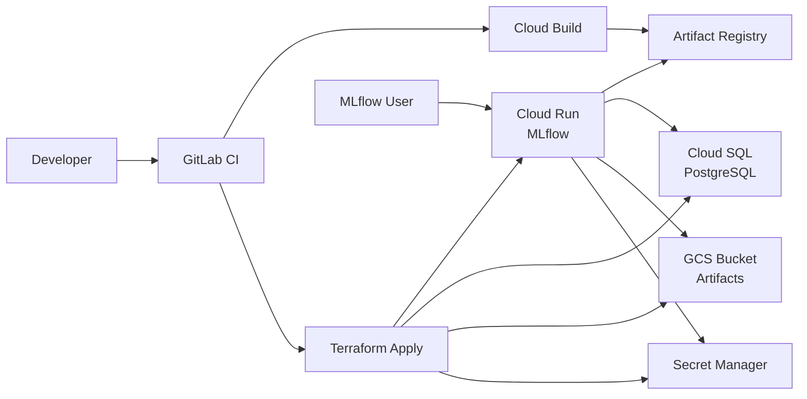

# terraform-gcp-mlflow

[](https://github.com/Ryotess/terraform-gcp-mlflow/actions/workflows/terraform-check.yml?query=branch%3Amain)

Infrastructure as Code project for deploying MLflow on Google Cloud Platform using Terraform.

## Architecture



This repository provisions:
- Cloud Run for the MLflow service
- Cloud SQL for PostgreSQL metadata storage
- GCS for artifact storage
- Secret Manager for runtime secrets
- Terraform for infrastructure provisioning
- An example GitLab CI pipeline for image build and deployment
- A minimal GitHub Actions workflow for Terraform validation on GitHub
- The container image installs `mlflow[auth,genai]` so mlflow would be protected by auth and can aggregate GenAI token usage and cost in the UI.

This repository is opinionated but usable as-is. The fastest path is:
1. Pick a GCP project and region.
2. Bootstrap GitLab OIDC and Terraform state.
3. Set CI variables.
4. Run the pipeline.
5. Log in to the deployed MLflow UI.

## What This Repo Creates

- One Cloud Run service running MLflow with the `basic-auth` app
- One Cloud SQL PostgreSQL instance and database
- One GCS bucket for MLflow artifacts
- One Secret Manager secret for the generated database password
- One runtime service account for Cloud Run
- One VPC, subnet, and private service access range for private Cloud SQL connectivity

## Repository Layout

- `infra/`: Terraform root module and environment tfvars
- `scripts/ci/`: GitLab CI helper scripts
- `.github/workflows/`: GitHub Actions checks
- `docs/`: bootstrap and operational docs
- `Dockerfile`: MLflow container image
- `entrypoint.sh`: MLflow startup script

## Before You Start

You need:
- A GCP project where you can create IAM, Cloud Run, Cloud SQL, networking, Artifact Registry, Secret Manager, and GCS resources
- A GitLab project where you can configure CI/CD variables
- `gcloud` installed locally for one-time bootstrap
- Terraform only if you plan to deploy from your machine instead of CI

You should decide these values up front:
- `PROJECT_ID`: your GCP project ID
- `REGION`: Cloud Run and Cloud SQL region, for example `us-central1`
- `DEPLOY_ENV`: usually `dev` for the first deployment
- The MLflow admin password you want to use
- A stable random Flask secret key

## Quick Start With GitLab CI

This is the recommended path.

### 1. Review the Environment Sizing

The files in `infra/environments/` contain non-secret settings such as instance sizing and retention:
- `infra/environments/dev.tfvars`
- `infra/environments/stg.tfvars`
- `infra/environments/prd.tfvars`

For a first deployment, review `infra/environments/dev.tfvars` and adjust values if needed.

Important:
- `artifact_bucket_location` defaults to `asia-east1` in Terraform.
- If you want the GCS artifact bucket in the same location as your deployment, set `artifact_bucket_location` explicitly when you deploy or add it to your tfvars.

### 2. Bootstrap GCP for GitLab OIDC

Follow the step-by-step guide in [docs/gitlab-gcp-bootstrap.md](docs/gitlab-gcp-bootstrap.md).

That guide creates:
- The Workload Identity Pool and OIDC provider
- The Terraform and image-push service accounts
- The Terraform state bucket
- The IAM bindings needed by this repository

### 3. Set GitLab CI/CD Variables

Set these required variables in GitLab CI/CD:

```text
GCP_PROJECT_ID_DEV
GCP_PROJECT_ID_STG
GCP_PROJECT_ID_PRD
GCP_REGION
GCP_WIF_PROVIDER
GCP_TERRAFORM_SA
GCP_ARTIFACT_PUSH_SA
TF_STATE_BUCKET
TF_STATE_PREFIX
GITLAB_OIDC_AUDIENCE
```

Set these secret variables as well:

```text
TF_VAR_mlflow_auth_admin_password
TF_VAR_mlflow_flask_server_secret_key
```

Optional variables:

```text
DEPLOY_ENV
TF_VAR_mlflow_auth_admin_username
TF_VAR_mlflow_auth_default_permission
```

Notes:
- `TF_VAR_mlflow_auth_admin_username` defaults to `admin`.
- `TF_VAR_mlflow_auth_default_permission` defaults to `NO_PERMISSIONS`.
- Mark the password and secret key variables as masked and protected if your GitLab setup supports that.

### 4. Run the First Deployment

The pipeline has four relevant stages:
- `bootstrap_image`: builds the MLflow image with Cloud Build and writes the image digest to an artifact
- `terraform_validate`: validates the Terraform configuration
- `terraform_plan`: plans the selected environment
- `terraform_apply`: manually applies the saved plan

Typical first deploy flow:
1. Push your branch and confirm `bootstrap_image`, `terraform_validate`, and `terraform_plan` succeed.
2. Merge to the default branch, or create a tag.
3. Run the manual `terraform_apply` job.

If you only have one GCP project for now, point `GCP_PROJECT_ID_DEV`, `GCP_PROJECT_ID_STG`, and `GCP_PROJECT_ID_PRD` to the same project until you split environments later.

### 5. Open MLflow

After apply completes, get the service URL from Terraform state:

```bash
cd infra
terraform init \
  -backend-config="bucket=$TF_STATE_BUCKET" \
  -backend-config="prefix=$TF_STATE_PREFIX/${DEPLOY_ENV:-dev}"

terraform output cloud_run_uri
```

Log in with:
- Username: `admin` unless you overrode `TF_VAR_mlflow_auth_admin_username`
- Password: the value you set in `TF_VAR_mlflow_auth_admin_password`

## Local Deployment Without GitLab CI

If you want to deploy from your machine instead of GitLab CI, use this flow.

### 1. Export Required Variables

```bash
export GCP_PROJECT_ID="your-project-id"
export GCP_REGION="us-central1"
export DEPLOY_ENV="dev"
export TF_STATE_BUCKET="${GCP_PROJECT_ID}-mlflow-tfstate"
export TF_STATE_PREFIX="mlflow"

export TF_VAR_mlflow_auth_admin_password="change-me"
export TF_VAR_mlflow_flask_server_secret_key="replace-with-a-long-random-string"
```

Optional overrides:

```bash
export TF_VAR_mlflow_auth_admin_username="admin"
export TF_VAR_mlflow_auth_default_permission="NO_PERMISSIONS"
```

### 2. Enable Required APIs and Create the Terraform State Bucket

```bash
gcloud config set project "${GCP_PROJECT_ID}"

gcloud services enable \
  artifactregistry.googleapis.com \
  cloudbuild.googleapis.com \
  cloudresourcemanager.googleapis.com \
  compute.googleapis.com \
  run.googleapis.com \
  secretmanager.googleapis.com \
  servicenetworking.googleapis.com \
  sqladmin.googleapis.com \
  storage.googleapis.com

gcloud storage buckets create "gs://${TF_STATE_BUCKET}" \
  --project="${GCP_PROJECT_ID}" \
  --location="${GCP_REGION}" \
  --uniform-bucket-level-access || true

gcloud storage buckets update "gs://${TF_STATE_BUCKET}" --versioning
```

### 3. Build and Push the MLflow Image

```bash
export ARTIFACT_REPOSITORY="mlflow"
export IMAGE_NAME="mlflow"
export IMAGE_TAG="manual"
export IMAGE_URI="${GCP_REGION}-docker.pkg.dev/${GCP_PROJECT_ID}/${ARTIFACT_REPOSITORY}/${IMAGE_NAME}:${IMAGE_TAG}"

gcloud artifacts repositories describe "${ARTIFACT_REPOSITORY}" \
  --project="${GCP_PROJECT_ID}" \
  --location="${GCP_REGION}" >/dev/null 2>&1 || \
gcloud artifacts repositories create "${ARTIFACT_REPOSITORY}" \
  --project="${GCP_PROJECT_ID}" \
  --location="${GCP_REGION}" \
  --repository-format=docker \
  --description="MLflow container images"

gcloud builds submit --tag "${IMAGE_URI}" .

export IMAGE_DIGEST="$(gcloud artifacts docker images describe "${IMAGE_URI}" --format='value(image_summary.digest)')"
export TF_VAR_mlflow_image="${GCP_REGION}-docker.pkg.dev/${GCP_PROJECT_ID}/${ARTIFACT_REPOSITORY}/${IMAGE_NAME}@${IMAGE_DIGEST}"
```

### 4. Apply Terraform

```bash
cd infra

terraform init \
  -backend-config="bucket=${TF_STATE_BUCKET}" \
  -backend-config="prefix=${TF_STATE_PREFIX}/${DEPLOY_ENV}"

terraform plan \
  -var="project_id=${GCP_PROJECT_ID}" \
  -var="region=${GCP_REGION}" \
  -var="artifact_bucket_location=${GCP_REGION}" \
  -var-file="environments/${DEPLOY_ENV}.tfvars"

terraform apply \
  -var="project_id=${GCP_PROJECT_ID}" \
  -var="region=${GCP_REGION}" \
  -var="artifact_bucket_location=${GCP_REGION}" \
  -var-file="environments/${DEPLOY_ENV}.tfvars"
```

### 5. Get the URL

```bash
terraform output cloud_run_uri
```

## Customization Notes

### Auth

- Cloud Run is publicly invokable.
- Access control is handled by MLflow's `basic-auth` app.
- The MLflow auth database migrations run against the same Cloud SQL database used for MLflow metadata.

### Host and CORS Allowlist

MLflow 3.5.0+ validates incoming host headers.

This stack automatically allows:
- The default Cloud Run hostname
- The matching `https://...run.app` origin

If you front MLflow with a custom domain, set:
- `additional_mlflow_allowed_hosts`
- `additional_mlflow_cors_allowed_origins`

### Secrets and State

- The Cloud SQL password is generated by Terraform and stored in Secret Manager.
- The same password also exists in Terraform state because Terraform must know it to create the SQL user.
- Keep the Terraform state bucket private and tightly access-controlled.

## Teardown

To destroy a deployment from your machine:

```bash
cd infra

terraform destroy \
  -var="project_id=${GCP_PROJECT_ID}" \
  -var="region=${GCP_REGION}" \
  -var="mlflow_image=${TF_VAR_mlflow_image}" \
  -var="artifact_bucket_location=${GCP_REGION}" \
  -var="artifact_bucket_force_destroy=true" \
  -var="deletion_protection=false" \
  -var-file="environments/${DEPLOY_ENV}.tfvars"
```

The GitLab pipeline also includes a manual `terraform_destroy` job. It requires:

```text
DESTROY_CONFIRM=destroy-<env>
```

Example:

```text
DESTROY_CONFIRM=destroy-dev
```

The destroy job removes:
- The Terraform-managed resources
- The Artifact Registry repository created by CI

It does not remove:
- The shared Terraform state bucket

## Common Gotchas

- `terraform_apply` only runs manually on the default branch or tags.
- If `GCP_TERRAFORM_SA` cannot deploy Cloud Run from Artifact Registry, make sure it has `roles/artifactregistry.reader`.
- If your bucket ends up in the wrong location, set `artifact_bucket_location` explicitly.
- If you use a custom domain and see MLflow host validation errors, set `additional_mlflow_allowed_hosts` and `additional_mlflow_cors_allowed_origins`.
